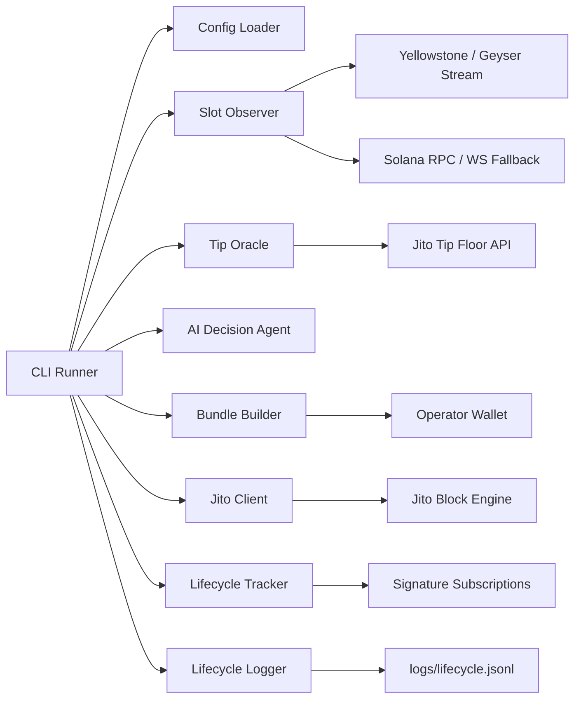

# Architecture Document

## System Goal

The stack sends Solana transactions as Jito bundles under changing network conditions.
It does more than submit a transaction: it watches the network, chooses timing and tip
parameters, observes commitment progression, records latency, classifies failures, and
lets an AI agent make operational decisions.

## Component Diagram



## Data Flow

1. The runner loads `.env` and CLI options.
2. `TipOracle` fetches recent tip floor data and Jito tip accounts.
3. `YellowstoneSlotStream` reads a live slot from a configured Geyser stream.
4. `SlotObserver` combines streamed slot data with leader schedule snapshots.
5. `OperationalDecisionAgent` chooses a tip from recent tips, congestion, and leader urgency.
6. `BundleBuilder` fetches a fresh `confirmed` blockhash and signs a bundle transaction.
7. `JitoClient` sends the bundle to the block engine.
8. `LifecycleTracker` observes signature updates for commitment progression.
9. `FailureClassifier` labels any failed run.
10. `OperationalDecisionAgent` decides whether to retry and what should change.
11. `LifecycleLogger` writes a complete JSONL evidence entry.

## Infrastructure Decisions

- **TypeScript** keeps the implementation close to the Jito TypeScript SDK ecosystem.
- **Fresh `confirmed` blockhash** avoids the stale-blockhash risk of `finalized`.
- **JSONL logs** make lifecycle evidence append-only and easy to parse.
- **Decision boundary isolation** keeps AI logic separate from transaction mechanics.
- **Dry-run mode** enables repeatable verification without spending SOL.
- **Real mode** uses signed transactions, Jito JSON-RPC, Yellowstone slot streaming, and websocket signature subscriptions.

## AI Agent Responsibilities

The agent owns two operational decisions:

- **Tip Intelligence:** choose the tip amount from recent tip observations and network conditions.
- **Failure Reasoning:** classify whether retry is appropriate and decide which parameters should change.

The agent returns structured decisions:

```json
{
  "lamports": 50000,
  "confidence": 0.72,
  "reasoning": "Tip selected from p75 recent tip floor with congestion adjustment."
}
```

Retry decisions include:

```json
{
  "shouldRetry": true,
  "refreshBlockhash": true,
  "tipMultiplier": 1.15,
  "reasoning": "Expired blockhash requires a fresh validity window before resubmission."
}
```

## Failure Handling Strategy

The stack classifies these failures:

- expired blockhash
- fee or tip too low
- compute exceeded
- bundle failure
- skipped leader
- unknown

Retry strategy depends on the classification:

- Expired blockhash: refresh blockhash, modestly increase tip, resubmit.
- Fee/tip too low: increase tip and retry.
- Skipped leader: wait for a new viable leader, refresh blockhash, retry.
- Compute exceeded: stop and require transaction-level fix.
- Unknown: stop for operator review.

## Yellowstone/Geyser Integration

`YellowstoneSlotStream` connects to a configured Geyser endpoint and reads the latest
live slot before each submission decision. This gives the decision loop stream-derived
slot timing while preserving RPC as a local-development fallback. In a production bounty
run, `YELLOWSTONE_ENDPOINT` and `YELLOWSTONE_X_TOKEN` should be set so slot observations
come from the stream path.

## Evidence Format

Each lifecycle entry contains:

- slot numbers
- target leader slot
- commitment stages
- timestamps
- latency deltas
- Jito tip amount
- bundle id
- signature
- failure classification
- AI decision reasoning

This evidence allows judges to verify that the stack ran against live infrastructure.
